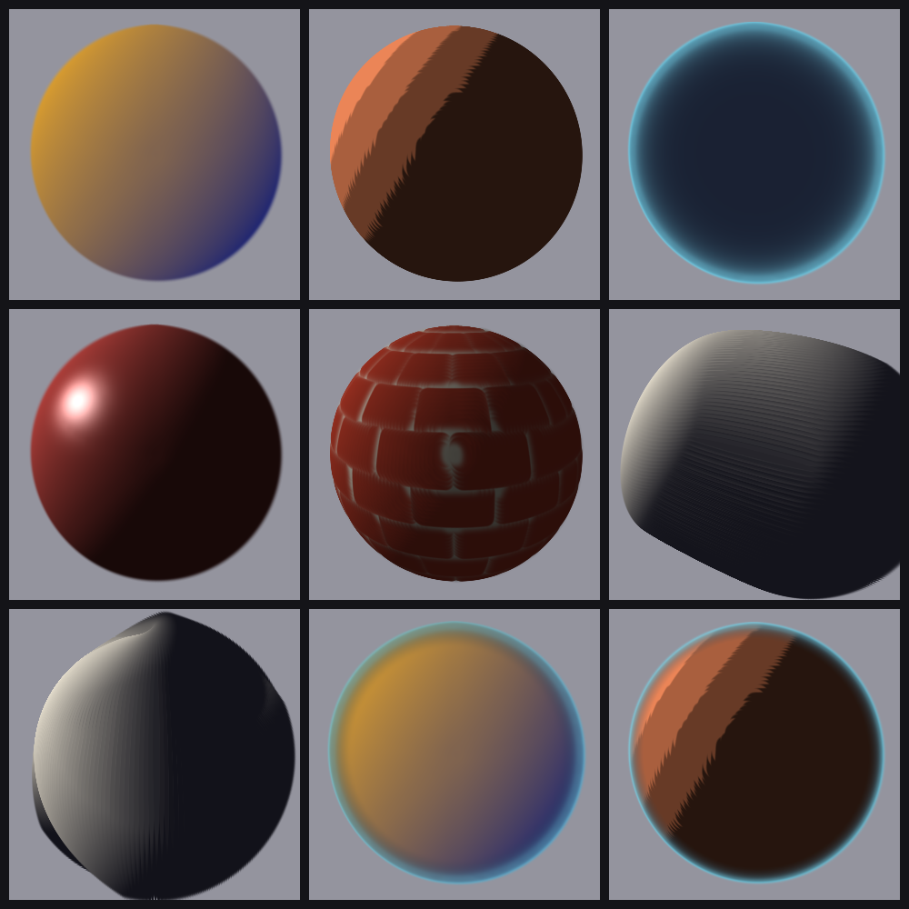

# GSSL — the Gaussian-Splat Shading Language

A small language for shading **3D Gaussian splats**. A GSSL shader is one pure
function from a splat's inputs to its full appearance — and unlike a screen-space
pixel shader, it shapes the **primitive's footprint**, not just the colour at a
pixel.

```
inputs (per splat)        uniforms (per frame)       output (per splat)
position, normal,    +    eye, light, time      →    color, opacity,
uv, curvature, tangent                               flatness, kernel, stroke
```

That last column is the point. A pixel shader can recolour a fragment; a GSSL
shader can turn the splat into a **crisp cel disk**, a **hollow ring-kernel rim
halo**, or an **oriented brush stroke that follows the surface grain** — because
it writes the splat's own falloff shape, falloff family, and covariance.



*The stdlib gallery, each shader on the same sphere. Top: Gooch cool-to-warm,
Toon (crisp cel disks), Fresnel rim (ring-kernel halo). Middle: Blinn-Phong,
procedural Brick (crisp faces, soft mortar), pen-and-ink Hatch (splats become
oriented strokes). Bottom: Curvature hatch (strokes along the surface grain),
Gooch ⊕ Rim, Toon ⊕ Rim. Rendered by `npm run gallery`.*

> Status: **v0.1** — a standalone, renderer-agnostic core extracted from the
> `emerging-splats` renderer. Language, standard library, test suite, build
> pipeline and a golden-image gallery (below) all run here. An interactive web
> playground is the next milestone.

## The model

- **A shader** is `(ShadeInputs) => ShadeOutput` — pure, composable, testable.
- **Outputs** span three paths:
  - colour path — `color`, `opacity` (written back into the splat);
  - shade bus — `flatness` (0 = smooth Gaussian … 1 = flat-topped disk) and
    `kernel` (`KERNEL_GAUSSIAN` | `KERNEL_RING`);
  - footprint — `aniso` (scale along the splat's own tangent axes) or `stroke`
    (lay the splat along an arbitrary in-plane direction, e.g. the curvature
    grain). These reshape the primitive via its covariance — no special renderer
    path.
- **Composition** is one operator, `over(base, top, mask)`, plus **masks**
  (`grazingMask`, `shadowMask`) — continuous lanes lerp, the discrete kernel is
  taken from the dominant layer. The operator is what turns the gallery into a
  language rather than a menu.
- **The substrate** is the *shade bus*: a packed `Float32Array`, one program per
  primitive in the renderer's draw order. `runShader(...)` is the "draw call" —
  it runs a shader over every splat, writes colour/opacity/footprint back, and
  returns the packed bus to hand to a host renderer.

## Standard library

`gooch`, `toon`, `fresnelRim`, `blinnPhong`, `brick`, `hatch`,
`curvatureHatch`, and the composed `goochRim` / `toonRim` — classic models
re-expressed in GSSL, each reaching for a splat-native lane the original can't.

## Example

```ts
import { runShader, over, grazingMask, gooch, fresnelRim } from 'gssl';

// a cool-to-warm body that grows a ring-kernel halo at its silhouette
const myShader = over(gooch, fresnelRim, grazingMask(0.5));

const shadeBus = runShader(myShader, splats, provenance, { eye, light, time }, restScale);
renderer.setShade(shadeBus); // hand the per-splat program to your renderer
```

## Renderer contract

GSSL is renderer-agnostic. A host shares two shapes (`src/types.ts`): the `Splat`
primitive it writes into, and an optional per-splat `SplatProvenance` (normal,
uv, curvature, tangent) a shader reads. The integration point is the shade bus
returned by `runShader` — wire it into your renderer's per-splat appearance
input. `emerging-splats` is the reference adapter.

## Develop

```
npm test          # node --test (type-stripped TS)
npm run typecheck  # tsc --noEmit
npm run build      # emit dist/ (ESM + .d.ts)
npm run gallery    # render the shader gallery (examples/) → out/ + docs/gallery.png
```

`examples/` holds a self-contained software rasterizer used only to render the
gallery — it is **not** part of the published package (the core is renderer-
agnostic; the shade bus from `runShader` is the integration point).

## License

MIT © Sean Zhai
